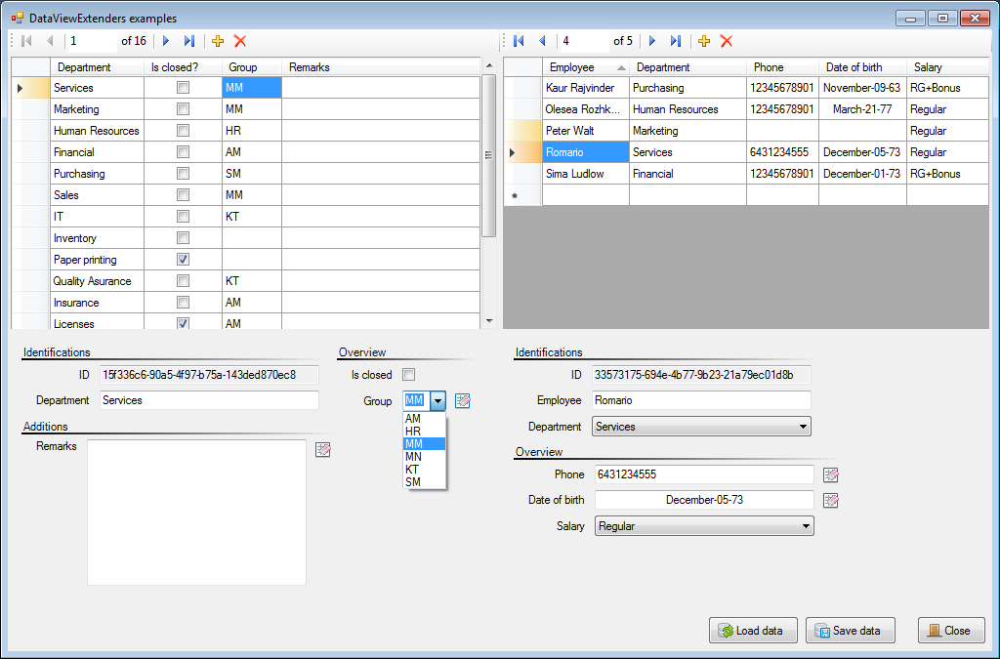

# DataViewExtenders

These extenders can generate data-bound columns in the DataGridView and data-bound controls in the FlowLayoutPanel. Moreover, extenders implement additional functionality for DataGridView, FlowLayoutPanel and provide several WinForms control.

## Features on DataGridView

1. DataRowState visualization in the RowHeaders for the changed and inserted rows (DataGridView.AddDataRowStateDrawingInRowHeaders)
2. Set visualization styles for DataGridViewColumns in a number of different ways (DataGridViewColumn.Set[MethodName]Style)
3. Preparation the DataGridView for showing data (PrepareStyleForShowingData), editing data (PrepareStyleForEditingData) and reports (PrepareStyleForShowingReportData).
4. Tuned and auto generating columns by DataType and preferences

### Features on FlowLayoutPanel and TableLayoutPanel

1. Panel with the grouping function
2. Tuned and auto generating fields by DataType and preferences
3. Auto determination of types with nullable

Please, read [Wiki](../../wiki) for detail information.

## Supported .NET Frameworks

_DataViewExtenders_ uses special things that were introduced in .NET Framework 4.0: 
- Extension Methods (introduced in .NET Framework 3.5)
- String.IsNullOrWhiteSpace method
- Tuple Class

## Credits

- [Farm-Fresh Web Icons](http://www.fatcow.com/free-icons) have been used in examples.
- [C# TextBox with Outlook 2007-style prompt](https://www.codeproject.com/Articles/15954/C-TextBox-with-Outlook-style-prompt) has been used in developing.
- Idea and source code from [Support filtering and searching on multiple columns with RowFilterBuilder](https://www.codeproject.com/Articles/14640/Support-filtering-and-searching-on-multiple-column) have been used in developing.

## Contacts

I would appreciate hearing your opinion on this. If you have any questions, please feel free to contact me by email: [radu.martin@hotmail.com](mailto://radu.martin@hotmail.com)
